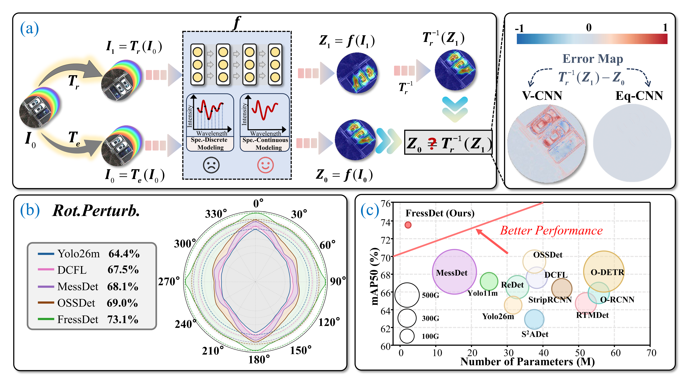

<div align="center">

# FressDet

### Compact Rotation-Equivariant Oriented Object Detection

<p>
  
  
  
  
</p>

**[Fully Rotation-Equivariant Spectral-Spatial Learning for Multispectral Object Detection](https://arxiv.org/abs/2607.05148)**  
Peng Zhang · Tingfa Xu<sup>†</sup> · Shuaihao Han · Jianan Li<sup>†</sup>  
<sup>†</sup> Corresponding authors

**Official PyTorch implementation of FressDet.** FressDet is a lightweight detector that preserves C4 rotation structure from feature extraction to oriented-box readout for multi-channel imagery.

[Paper](https://arxiv.org/abs/2607.05148) · [PDF](https://arxiv.org/pdf/2607.05148) · [Results](#results) · [Installation](#installation) · [Training](#training) · [Evaluation](#evaluation) · [Citation](#citation)

</div>

---

## News

- **2026-07-20:** Released the cleaned training and evaluation code.

## Overview

FressDet represents intermediate features as explicit rotation-group tensors and carries this structure through the backbone, neck, and prediction head. Its main components are:

- **Rotation-equivariant feature hierarchy.** `RELiftGCBA`, `SpeIWMetaformerStage`, `PatchMerging`, and `RESPPF` construct a compact C4 feature pyramid.
- **ReCoW neck.** Rotation-Equivariant Consistency Weighting combines spectral soft routing with spatial hard routing and agreement-aware residual fusion.
- **Group-aware oriented head.** `OAHead` uses group-shared classification, cyclic angle decoding, and cyclic box readout with side-shared bias.

<p align="center">
  
</p>

<p align="center"><em>Figure 1. Motivation and overview of FressDet.</em></p>

## Results

### DrMOD validation set

| Model | Input size | Parameters | Epochs | mAP50 | mAP50–95 | Checkpoint |
|:--|:--:|--:|--:|--:|--:|:--:|
| **FressDet** | 1200 | **2.53 M** | 20 | **73.65** | **54.51** | [best.pt](https://github.com/Riiluo/FressDet/releases/download/v1.0/best.pt) |

The complete 20-epoch training record is available in [`results.csv`](results.csv).

## Installation

The released code and the reported results were validated in the following reference environment:

| Component | Version |
|---|---|
| Operating system | Ubuntu 24.04.4 LTS |
| GPUs | 2 × NVIDIA GeForce RTX 3090 (24 GB each) |
| NVIDIA driver | 595.45.04 |
| Python | 3.10.19 |
| PyTorch | 2.2.2+cu121 |
| TorchVision | 0.17.2+cu121 |
| CUDA runtime | 12.1 |
| cuDNN | 8.9.2 |
| NCCL | 2.19.3 |
| NumPy | 1.26.4 |
| OpenCV | 4.9.0.80 |
| Ultralytics codebase | 8.3.9 (modified copy bundled with this repository) |

```bash
conda create -n fressdet python=3.10 -y
conda activate fressdet

pip install torch==2.2.2 torchvision==0.17.2 \
  --index-url https://download.pytorch.org/whl/cu121
pip install ultralytics==8.3.9 einops numpy==1.26.4 \
  opencv-python==4.9.0.80 pyyaml scipy pandas matplotlib tqdm psutil thop
```

For strict reproduction, run all commands from the repository root so that Python imports the modified `ultralytics` package bundled with FressDet rather than another installation from `site-packages`.

## Data preparation

FressDet expects eight-channel NumPy inputs and YOLO-format oriented-box labels. Organize DrMOD as follows:

```text
DrMOD/
├── images/
│   ├── train/*.npy
│   ├── val/*.npy
│   └── test/*.npy
└── labels/
    ├── train/*.txt
    ├── val/*.txt
    └── test/*.txt
```

Then edit `ultralytics/cfg/datasets/drmod.yaml`:

```yaml
path: /absolute/path/to/DrMOD
train: images/train
val: images/val
test: images/test
channels: 8
```

Each label row follows the Ultralytics OBB convention:

```text
class x1 y1 x2 y2 x3 y3 x4 y4
```

Coordinates are normalized to `[0, 1]`.

## Training

The public entry point contains the reported two-GPU recipe:

```bash
CUDA_VISIBLE_DEVICES=0,1 \
torchrun --standalone --nproc_per_node=2 train.py
```

## Evaluation

Download [`best.pt`](https://github.com/Riiluo/FressDet/releases/download/v1.0/best.pt) from the GitHub Release and place it in the repository root:

```text
best.pt
```

and run:

```bash
python val.py
```

To evaluate another checkpoint, change `WEIGHTS` in `val.py`.

## Citation

If you find FressDet useful in your research, please cite our paper:

```bibtex
@misc{zhang2026fressdet,
  title         = {Fully Rotation-Equivariant Spectral-Spatial Learning for Multispectral Object Detection},
  author        = {Peng Zhang and Tingfa Xu and Shuaihao Han and Jianan Li},
  year          = {2026},
  eprint        = {2607.05148},
  archivePrefix = {arXiv},
  primaryClass  = {cs.CV},
  url           = {https://arxiv.org/abs/2607.05148}
}
```

## Acknowledgements

This repository is built on [Ultralytics](https://github.com/ultralytics/ultralytics) and [PyTorch](https://github.com/pytorch/pytorch). We thank their authors and maintainers for making their work publicly available.

## License

This project is released under the [GNU Affero General Public License v3.0](LICENSE). It includes code derived from [Ultralytics](https://github.com/ultralytics/ultralytics), which is distributed under the same license.
